<h2 align="center">Hi there 👋, I'm Yu-Cheng Kuo</h1>
<h3 align="center">A passionate C++ Software Engineer</h3>

- 🌱 I’m currently working on or learning ... 
    - CUDA / Lock-Free Techniques / Modern C++: 
        - [CUDA 01 — Streams & Events Walkthrough](https://yc-kuo.medium.com/cuda-01-streams-events-walkthrough-5ff0a32fc1ea)
        - [C++ Series 05 | Mutex / Atomic / Lock-Free (CAS)](https://yc-kuo.medium.com/c-series-05-mutex-atomic-lock-free-cas-de7f6d3b7997)
        - [Complete Modern C++ (C++11/14/17) Specialization (3 courses)](https://www.coursera.org/account/accomplishments/specialization/WOMB1OZ1L9AU)
    - DSA (w. C++): 
        - [Top 35% in LeetCode contests (w. C++)](https://leetcode.com/yu-cheng-kuo/)
        - [leetcode-doc-cpp](https://github.com/yu-cheng-kuo-28/leetcode-doc-cpp)

- 📝 I regularly write articles on [https://yc-kuo.medium.com](https://yc-kuo.medium.com/) (CS/ML blog in English with **270+** followers & 50+ articles; 40+ articles featured on *Analytics Vidhya* & *Nerd For Tech*)

- 📄 Know about my experiences: [resume_YuCheng_Kuo_20250427](https://drive.google.com/file/d/17hXiHf1BdISF9dTx0M5EB9JVGmGWZBPk/view)

- 📫 How to reach me: [Linkedin](https://www.linkedin.com/in/yu-cheng-kuo/) & **yc.kuo.28@gmail.com**

- ⚡ Fun fact: I'm an amateur fighter who loves all kinds of sports
    | # | Year | Sport | Tournament/Match/Certificate | Achievement |
    |---|------|-------|--------|----------|
    | 1 | 2022 | Freediving | Freediving Certification: PADI Freediver (10m depth dive) | Passed |
    | 2 | 2020 | Boxing | Taiwan North District University Amateur Boxing Fight, Man 60 KG | 🏆 Winner (3-0) |
    | 3 | 2019 | Boxing | Taiwan North District University Amateur Boxing Fight, Man 60 KG | 🏆 Winner (1-0) |
    | 4 | 2019 | Chinese Boxing   (Sanda) | NTU Chinese Boxing (Sanda) Tournament, Man 60 KG | 🥇 1st Place |
    | 5 | 2018 | Jiu-Jitsu | Taiwan National Jiu-Jitsu Open Tournament, Man White Belt 57.5 KG | 🥇 1st Place |
    | 6 | 2015 | Judo | NTHU Judo Tournament, Man White Belt 60 KG | 🥉 3rd Place |

# Latest Blog Posts
<!-- BLOG-POST-LIST:START -->
- [C++ Series 06 | PGO &lpar;Profile-Guided Optimization&rpar;](https://medium.com/nerd-for-tech/c-series-06-pgo-profile-guided-optimization-8a978bd6881f?source=rss-834bbb11d825------2)
- [CUDA 01 — Streams &amp; Events Walkthrough](https://medium.com/nerd-for-tech/cuda-01-streams-events-walkthrough-5ff0a32fc1ea?source=rss-834bbb11d825------2)
- [C++ Series 05 | Mutex / Atomic / Lock-Free &lpar;CAS&rpar;](https://medium.com/nerd-for-tech/c-series-05-mutex-atomic-lock-free-cas-de7f6d3b7997?source=rss-834bbb11d825------2)
- [C++ Series 04 | Runtime Cost of C++ Compared to C](https://medium.com/nerd-for-tech/c-series-04-runtime-cost-of-c-compared-to-c-26bd41214884?source=rss-834bbb11d825------2)
- [C++ Series 03 | Mutex &amp; Semaphore with LeetCode](https://medium.com/nerd-for-tech/c-series-03-mutex-semaphore-with-leecode-0de966275919?source=rss-834bbb11d825------2)
- [C++ Series 02 | Lambda Evolution: From C++11 to C++17 &lpar;and Why You Should Abandon std::bind&lpar;&rpar;&rpar;](https://medium.com/nerd-for-tech/c-02-lambda-evolution-from-c-11-to-c-20-and-why-you-should-abandon-std-bind-2896cb80f7e5?source=rss-834bbb11d825------2)
<!-- BLOG-POST-LIST:END -->

<h3 align="left">Connect with me:</h3>

<h3 align="left">Languages and Tools:</h3>

               

<!-- 

&nbsp;
 -->

## 📊 GitHub Stats

  
  

